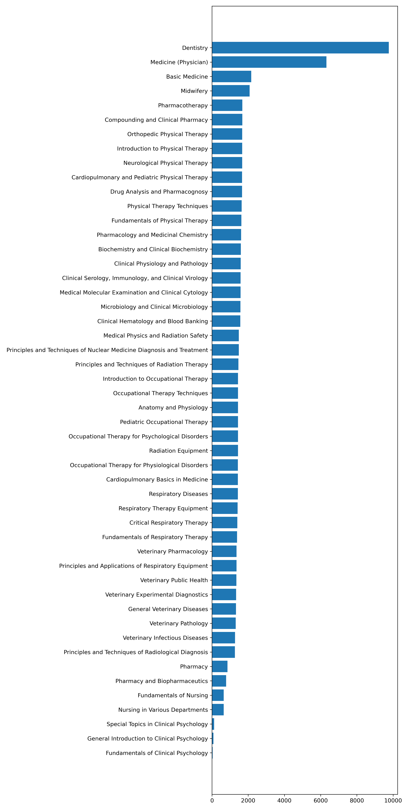

# Examinations-for-Medical-Personnel-in-Chinese(EMPC)

This repo provides a test to measure language models' ability to answer medical questions in Chinese. (Both Traditional and Simplified)

EMPC contains the recent 10 years of test questions of the **Professional and Technical Examinations for Medical Personnel** in Taiwan whose health care is ranked 1st and 4th by Numbeo and Statista respectively in 2023.

We collect the tests for various medical professionals such as  *Medical Technologist, Medical Radiation Technologist, Registered Professional Nurse, Physical Therapist* et. al. There are in total of 81761 single-choice questions covering a wide range of subjects including *General Clinical Psychology, Anatomy and Physiology, Fundamentals of Respiratory Care, and Occupational Therapy Techniques* et.al. The distribution of the questions over subjects is shown here 
. And the distribution over professions is as follows:

More details can be found in the upcoming report for this test.

<!--Psychological Disorder Occupational Therapy, Respiratory Therapy Equipment, Veterinary Infectious Diseases, Respiratory Device Principles and Applications, Clinical Hematology and Blood Banking, Pharmacy, Veterinary Pathology, Neurological Disease Physiotherapy, Dispensing and Clinical Pharmacy, Basic Nursing, Biochemistry and Clinical Biochemistry, Special Topics in Clinical Psychology, Clinical Psychology Foundations, Physiological Barrier Occupational Therapy, Veterinary Laboratory Diagnosis, Medical Molecular Testing and Clinical, Pharmacy and Biopharmacy, Respiratory Diseases, Dentistry, Pharmacology and Pharmaceutical Chemistry, Cardiopulmonary Basic Medicine, Various Nursing, Orthopedic Disease Physiotherapy, Radiology Diagnostic Principles and Techniques, Physiotherapy Techniques, Drug Therapy, Veterinary Public Health, Nuclear Medicine Diagnostic and Therapeutic Principles and Techniques, Clinical Physiology and Pathology, Introduction to Occupational Therapy, Severe Respiratory Therapy, Pediatric Occupational Therapy, Radiation Therapy Principles and Techniques, Drug Analysis and Herbal Medicine, Introduction to Physiotherapy, Midwifery, Radiology Equipment, Medicine, Microbiology and Clinical Microbiology, Physiotherapy Foundations, Clinical Serum Immunology and Clinical, Cardiopulmonary Disease and Pediatric Disease, Veterinary Pharmacology, Fundamentals of  Medicine, Veterinary General Disease, and Medical Physics and Radiation Safety-->

We tested the 2023 first-time examination set (2840) on multiple LLMs with zero-shot the results are shown as follows:

| Model           | Zero-Shot|   
|-----------------|----------|
| GPT3.5-Turbo    | 52.25%   | 
| GPT4            | 65.46%   |

EMPC forms a remarkable challenge for AI models and can serve as an effective tool to evaluate models' medical knowledge encoded in Chinese. We hope EMPC could support the exploration and building of Large Multi-lingual or Chinese Language Models, especially in the medical domain.

Our dataset can be downloaded from [Google Drive](https://drive.google.com/file/d/1o4_SzQIc3P4NPpP8_6pvyFaLNRCQhptA/view?usp=sharing) and [百度网盘](https://pan.baidu.com/s/10JcniARsH8u-wS9JS4QfAQ?pwd=94kd).
